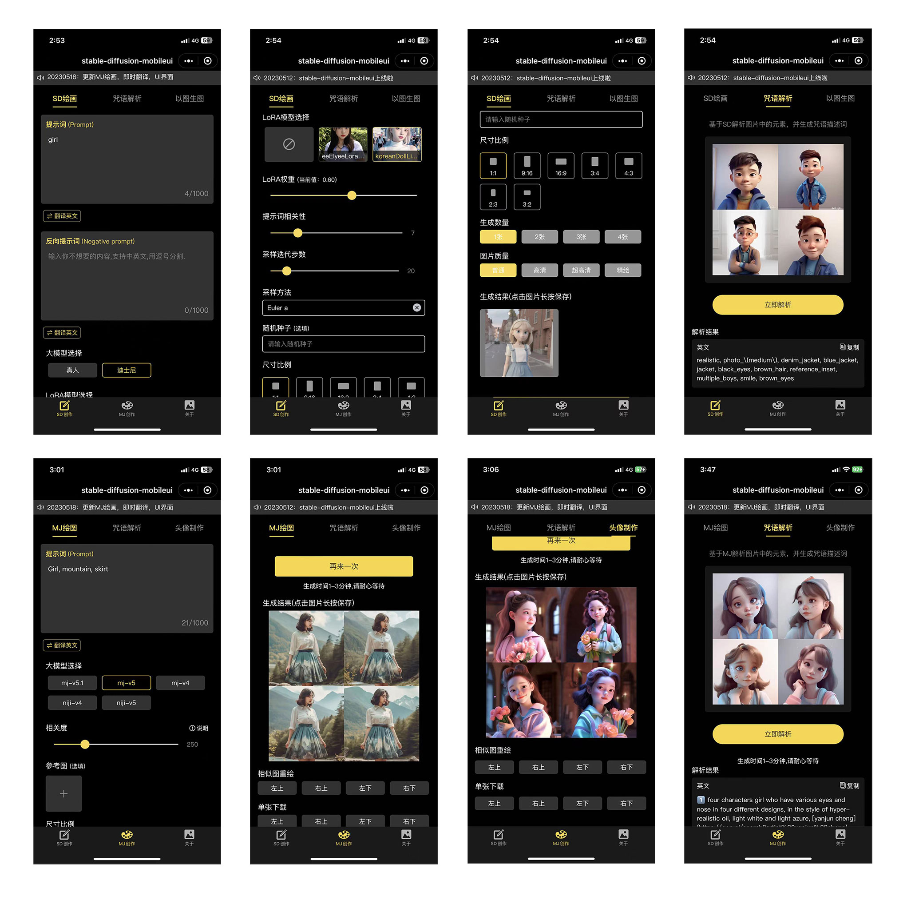
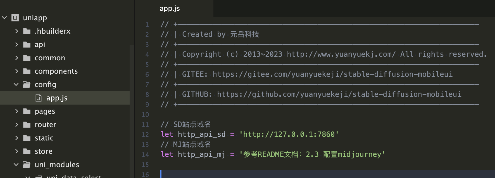

# 프로젝트 요약

이 저장소(Koowon-Park/stable-diffusion-mobileui)는 Stable Diffusion 모델을 기반으로 한 프로젝트로, 모바일 환경에 적합한 사용자 인터페이스(UI)를 제공합니다. 주요 특징은 다음과 같습니다:

"일체형(one-click) 패키지" 기반으로 손쉽게 환경을 구축할 수 있습니다.
Stable Diffusion을 이용해 이미지 생성 기능을 제공합니다.
모바일 웹(H5)과 위챗 미니프로그램(微信小程序)에서 사용할 수 있도록 UI가 최적화되어 있습니다.
주요 개발 언어는 Vue, JavaScript, SCSS 등입니다.
요약:
Stable Diffusion 이미지 생성 기능을 모바일에서도 쉽게 사용할 수 있도록, 간편 설치 및 모바일/위챗 미니프로그램에 특화된 UI를 제공하는 오픈소스 프로젝트입니다.

#번역
아래는 stable-diffusion-mobileui 저장소의 README.md 전체 한글 번역입니다.

---

# stable-diffusion-mobileui

## 1. 프로젝트 소개

Stable Diffusion과 Midjourney를 언제 어디서나 간편하게 사용할 수 있습니다. 일체형 패키지 기반의 stable-diffusion에 본 프로젝트를 결합하면 모바일에 최적화된 UI를 구축할 수 있으며, H5와 위챗 미니프로그램을 생성할 수 있습니다.

### 1.1 효과 예시

### 1.2 주요 기능

|입구|기능 모듈|기능 포인트|설명|
|:----|:----|:----|:----|
|SD창작|SD그리기|프롬프트|중·영문 입력 가능, 자동 번역|
|    |    |역방향 프롬프트|중·영문 입력 가능, 자동 번역|
|    |    |대형 모델 선택|SD 대형 모델 선택|
|    |    |LoRA 모델 선택|선택 가능, 가중치 설정 필요|
|    |    |프롬프트 관련성|기본값 7, 1~30 선택 가능|
|    |    |샘플링 반복 횟수|기본 20, 1~150 선택 가능|
|    |    |샘플링 방식|    |
|    |    |크기 비율|다양한 비율 선택 가능|
|    |    |생성 수량|기본 1장, 1~4장 선택 가능|
|    |    |이미지 품질|일반, 고화질, 정밀|
|    |    |생성 결과|클릭 후 길게 눌러 기기에 저장|
|    |    |랜덤 시드|기본값 -1|
|    |주문어 해석|이미지 선택|이미지 업로드|
|    |    |해석 결과|영문 결과 확인 및 복사|
|    |이미지로 이미지|곧 출시|    |
|MJ창작|MJ그리기|프롬프트|중·영문 입력 가능, 자동 번역|
|    |    |모델 선택|MJ 모델 선택|
|    |    |관련도 선택|기본 250, 0~1000 선택 가능|
|    |    |배경 이미지 가중치|기본 1, 0.5~2 선택 가능|
|    |    |배경 이미지 선택|선택 가능|
|    |    |크기 비율|기본 1:1, 다양한 비율 선택 가능|
|    |    |UV 변환|재그리기 및 개별 다운로드 가능|
|    |주문어 해석|이미지 선택|이미지 업로드|
|    |    |해석 결과|영문 결과 확인 및 복사|
|    |프로필 제작|이미지 선택|배경 이미지 업로드|
|    |    |타입 선택|아기, 남자아이, 여자아이|
|    |    |UV 변환|재그리기 및 개별 다운로드 가능|
|소개|About us|프로젝트 설명|    |
|상단|알림바|스크롤 메시지 알림|    |

### 1.3 곧 출시

1. SD 이미지 투 이미지  
2. MJ 합성 이미지

### 계속 업데이트 및 최적화 중이니 Star 부탁드립니다.  
맞춤 개발이 필요하시면 연락주세요.  
반드시 배포 문서대로 구축 후 추가 활용해 주세요.  
모든 자료는 단체 채팅방 공지에 있습니다. 문제가 있으면 issue를 남겨주세요.

## 2. 구축 방법

### 2.1 일체형 패키지 설치

2.1.1 일체형 패키지는 秋葉aaaki의 통합팩을 사용합니다. 바로 다운로드하여 안내에 따라 설치하세요.  
원본 바이두 링크: https://pan.baidu.com/s/1MnyQH_gWgVdxU1S_Hjc5JQ (암호: t724)

※ 링크가 만료됐을 경우 단체방에서 최신 링크를 확인하세요(단체방 번호는 맨 아래 참조).

2.1.2 설치 후 시작 화면의 왼쪽 [고급 옵션] → [네트워크 설정] → [원격 연결 허용], [API 활성화] 체크, 아래로 내려가 [CORS 권한 관리]에서 추가...

2.1.3 왼쪽에서 상단 첫 [일체형 시작] 클릭, 시작 화면으로 돌아가 우측 하단 [일체형 시작] 클릭

### 2.2 H5 버전 설치

2.2.1 본 저장소의 uniapp 폴더 다운로드  
2.2.2 Hbuilder로 프로젝트 열기 → uniapp/config/app.js의 http_api_sd에 본인 도메인 입력  
※ 이 도메인은 [SD 일체형 패키지]의 주소이며, 기본값은 http://127.0.0.1:7860

  

2.2.3 Hbuilder 툴바 → 실행 → 브라우저에서 실행 → Chrome  
2.2.4 배포 시 Hbuilder 툴바 → 배포 → 웹사이트-PCweb 또는 모바일H5 → 빌드된 파일을 서버에 업로드  
이때 반드시 로컬 SD 내부...

### 2.3 Midjourney 설정(선택)

Midjourney 계정이 있고 MJ 그리기 기능을 사용하려면 단체방(QQ 번호 맨 아래 참조)에 들어가서 공지에서 설정 문서를 확인하세요(모든 자료는 공지에 있음).

### 2.4 위챗 미니프로그램 설치

2.4.1 위의 api 주소 설정 후, 위챗 미니프로그램 appid만 설정하면 됩니다. 위치: 소스코드 루트 manifest.json, 클릭 후 우측에서 위챗 미니프로그램 설정, 상단에 appid 입력...

2.4.2 Hbuilder 툴바 → 실행 → 미니프로그램 시뮬레이터에서 실행 → 위챗 개발자 도구

## 3. 기타 자료

3.1 LoRA 모델 추가  
다운로드: https://civitai.com/  
경로: SD 루트 \models\Lora\ 폴더

3.2 대형 모델 추가  
다운로드: https://huggingface.co/models  
경로: SD 루트 \models\Stable-diffusion\ 폴더

3.3 내트워크 터널링: FRP, NPS, zerotier  
FRP: https://github.com/fatedier/frp  
NPS: https://ehang-io.github.io/nps/#/  
zerotier: https://www.zerotier.com/

## 4. 자주 묻는 질문

4.1 CORS 문제 해결법  
위의 설치 방법 2.1.2 참조

4.2 LoRA에 이미지가 없을 때  
직접 이미지를 추가해야 하며, 예를 들어 LoRA 이름이 AAA.safetensors라면 동일 폴더에 AAA.png로 이미지를 넣으면 됩니다.

4.3 외부에서 접속하려면  
3.3의 내트워크 터널링 방법을 참고하여 H5 또는 미니프로그램의 도메인 주소를 다시 설정하세요.

4.4 배포 후 접속이 안 될 때  
SD가 외부로 포워딩(포트 매핑)되어 있는지, MJ 인터페이스가 완전히 구축됐는지, 도메인이 HTTPS로 설정됐는지 확인하세요.

4.5 LoRA 모델을 추가했는데 H5 또는 미니프로그램에서 보이지 않을 때  
SD 일체형 패키지를 재시작하세요.

## 5. 업데이트 로그

2023-06-14: API가 MJAPI2.2.3에 맞게 업데이트됨. 긴급 패치, 반드시 업데이트 필요. UNIAPP UI는 변경 없음  
2023-06-09: MJAPI2.1.6에 맞게 업데이트, 이미지 안전 검사 설정 옵션 추가  
2023-05-26: Midjourney 텍스트-이미지, 주문어 해석 추가, Midjourney 이미지-이미지 완성, 모델과 관련성 선택 지원, SD 문제 수정, MJ 연동 문서 업데이트  
2023-05-20: Midjourney 이미지-이미지 UV 변환, MJ 연동 문서 업데이트  
2023-05-18: Midjourney 이미지-이미지 추가, 새로운 UI, 실시간 번역 추가  
2023-05-12: 첫 버전 공개

## 6. 연락처
- QQ 토론방: 169978924

---

# stable-diffusion-mobileui

## 1. 项目介绍

方便随时随地的使用stable diffusion和Midjourney。基于一键包搭建的stable-diffusion，配合本项目可以搭建适配移动端的界面UI，可以生成H5和微信小程序。

### 1.1效果展示

### 1.2主要功能：

|入口|功能模块|功能点|说明|
|:----|:----|:----|:----|
|SD创作|SD绘画|提示词|可填中英文词，自带翻译|
|    |    |反向提示词|可填中英文词，自带翻译|
|    |    |大模型选择|选择 SD大模型|
|    |    |LoRA模型选择|可选，选择需设置权重|
|    |    |提示词相关性|默认7，可选1-30|
|    |    |采样迭代步数|默认20，可选1-150|
|    |    |采样方法|    |
|    |    |尺寸比例|多比例选择|
|    |    |生成数量|默认1张，可选1-4张|
|    |    |图片质量|普通、高清、精绘|
|    |    |生成结果|点击后，长按保存到设备|
|    |    |随机数种子|默认-1|
|    |咒语解析|选择图片|上传图片|
|    |    |解析结果|查看和复制英文结果|
|    |以图生图|敬请期待|    |
|MJ创作|MJ绘画|提示词|可填写中英文，自带翻译|
|    |    |模型选择|选择mj的模型|
|    |    |相关度选择|默认250，可选0-1000|
|    |    |垫图权重选择|默认1，可选0.5-2|
|    |    |垫图选择|可选|
|    |    |尺寸比例|默认1:1，多比例选择|
|    |    |UV转换|可重绘和单独下载|
|    |咒语解析|选择图片|上传图片|
|    |    |解析结果|查看和复制英文结果|
|    |头像制作|选择图片|上传垫图|
|    |    |选择类型|婴儿，男孩，女孩|
|    |    |UV转换|可重绘和单独下载|
|关于|关于我们|项目说明|    |
|顶部|通知栏|滚动消息通知|    |

### 1.3即将发布：

1.SD图生图

2.MJ合成图

### 不断更新优化，欢迎Star。如需定制，欢迎联系
### 请严格按照部署文档搭建完成后再自行发挥。  
### 所有资料均在群公告,有问题请提交issue.  

## 2. 搭建步骤

### 2.1 安装一键端

2.1.1一键端使用的是秋葉aaaki的整合包，直接下载根据说明安装即可

秋叶大佬原百度网盘链接https://pan.baidu.com/s/1MnyQH_gWgVdxU1S_Hjc5JQ 提取码t724

注意：若链接失效，加群获取最新，群号见最下方

2.1.2 安装完成后在启动界面找到左侧的【高级选项】--【网络设置】--勾选【开放远程连接】，勾选【启用API】，往下拉，找到【CORS授权管理】--新增一条记录为*

2.1.3 回到左侧，点击左上角第一个【一键启动】，回到启动界面，点击右下角的【一键启动】

### 2.2 安装H5端
2.2.1 下载本仓库下的`uniapp`文件夹;  

2.2.2 使用`Hbuilder`打开项目,在`uniapp/config/app.js`中的`http_api_sd`处填写您的域名;  

此处的域名是指你启动的【SD一键包】的地址，一般默认为http://127.0.0.1:7860
 
  

2.2.3 `Hbuilder`工具栏->运行->运行到浏览器->Chrome;  

2.2.4 如需发布到公网，则依次点击发布即可`Hbuilder`工具栏->发行->网站-PCweb或手机H5;将打包后的文件上传到服务器即可。此时要注意，必须将本地SD内网穿透到外网，否则无法访问。 

### 2.3 配置midjourney【可选】
如果有midjourney账号，需要调用MJ绘画功能的话，请加QQ群（群号见最下方），查看群公告获取midjourney的配置文档(全部资料均在群公告)。

### 2.4 安装微信小程序
2.4.1在以上配置好api地址后，仅需配置微信小程序appid即可，位置在：源码根目录manifest.json,点击后，右侧找到微信小程序配置，配置顶部的微信小程序APPID即可。

2.4.2 `Hbuilder`工具栏->运行->运行到小程序模拟器->微信开发者工具; 

## 3. 其他资料
3.1新增LoRA模型

LoRA模型下载地址：https://civitai.com/

放置位置：SD根目录的 \models\Lora\目录下

3.2新增大模型

大模型下载地址：https://huggingface.co/models

放置位置：SD根目录的 \models\Stable-diffusion\目录下

3.3内网穿透方式FRP，NPS，zerotier

FRP官网：https://github.com/fatedier/frp

NPS官网：https://ehang-io.github.io/nps/#/

zerotier官网：https://www.zerotier.com/

## 4. 常见问题

4.1跨域如何解决

见上方搭建步骤2.1.2

4.2LoRA无图片如何解决

需要自行新增图片，假设LoAR名称为AAA.safetensors，在其同级目录下放置一张你喜欢的图片，重命名为AAA.png即可

4.3如果需要从外网访问到，需根据3.3的方式配置内网穿透并且重新设置H5或小程序的域名地址

4.4我发布到公网服务器或者小程序了，为什么接口访问不到呢？

请查看SD是否内网穿透映射到了外网，MJ接口是否完整搭建。是否将域名都配置了HTTPS

4.5我新增了LoRA模型为什么没有在小程序端或者H5端显示呢？

请重启SD一键端

## 5. 更新日志
20230614：API适配MJAPI2.2.3;紧急修复，必须更新。UNIAPP界面可不动

20230609：适配凯大佬的MJAPI2.1.6;图片安全审查配置可选

20230526：新增midjourney文生图和咒语解析，完善midjourney图生图，支持选择模型，相关度等，修复SD问题，更新MJ接入文档，

20230520：新增midjourney图生图UV转换，MJ接入文档更新

20230518：新增midjourney以图生图，更新新的UI界面，新增即时翻译

20230512：初版发布
## 6. 联系我们  
- QQ讨论群:169978924

 

